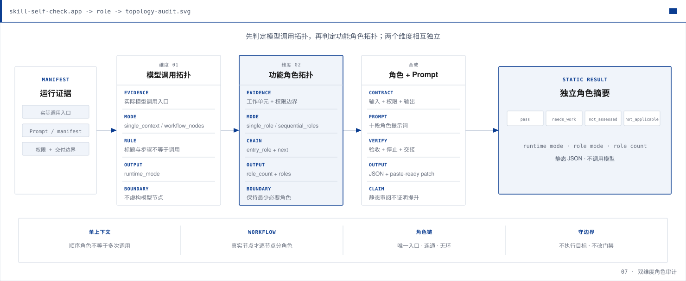
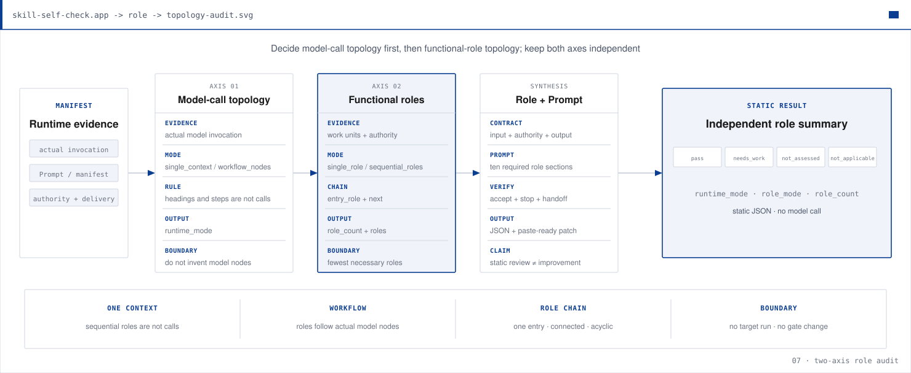

# Skill Self-Check · Agent Skill 静态审计包

[](CHANGELOG.md)
[](docs/INSTALLATION.md)
[](LICENSE)

**[中文](#中文)** · **[English](#english)**

当前版本：**0.4.1**。版本来源以 [`plugin.json`](plugin.json) 为准，变更记录见
[`CHANGELOG.md`](CHANGELOG.md)。

---

# 中文

Skill Self-Check 用确定性 Python 脚本检查 Agent Skill 的结构、使用契约和静态安全线索，
再由 AI 根据脚本证据给出修改建议。内置脚本只读取本地文件，**不会执行被审计 Skill 的代码**。

`gate_verdict` 是核心门禁结论；数字分数只提供诊断信息，不决定是否通过。运行行为、真实外部操作和
平台兼容性需要单独验证。

## 三个正式 Skill

| Skill | 用途 | 何时使用 |
| --- | --- | --- |
| `skill-self-check` | 检查 Skill 包结构、触发条件、排除场景、验收标准和配套资源 | 默认入口；写完或修改 Skill 后使用 |
| `skill-ship-safety` | 静态检查邮件、消息、API 写入等外部操作风险 | Skill 会触达真实系统或数据时使用 |
| `agent-work-readiness` | 把口头流程整理成目标、步骤、角色、交接、指标和权限 | 工作流程还没有说清楚时先使用 |

三个 Skill 可以一起安装，也可以只安装 `skill-self-check`。核心门禁不依赖另外两个 Skill。

## 最快用法

已有一个包含 `SKILL.md` 的文件夹时，把下面内容发给正在协助你的 AI：

```text
请使用这个开源包检查我的 Skill：
https://github.com/xenos2025/Skill-Self-Check

要求：
1. 安装 skill-self-check，或直接读取仓库中的 skills/skill-self-check/SKILL.md
2. 对我提供的 Skill 目录运行默认快速审计
3. 先报告 gate_verdict、全部 Critical 和最多三项 Should fix
4. 不要修改文件；等我说“按意见改”后再修改，并在修改前保存基线
5. 修改后用 verify_fix.py 对照基线复检，不要凭记忆声称已经修复
```

默认流程：

1. 运行确定性门禁。
2. 先报告，不直接修改目标。
3. 用户明确说“按意见改”后，保存基线并修改。
4. 重新运行检查，报告修改前后的实际差异。

## 如何看结果

| 字段 | 含义 |
| --- | --- |
| `gate_verdict` | 权威门禁：`pass`、`fail` 或 `invalid_skill_package` |
| `gate_reasons` | 门禁未通过的确定性原因 |
| Critical | 必须先解决的问题；默认全部展示 |
| Should fix | 建议改进的问题；默认最多展示三项，其余保留在 JSON |
| `basic_usable` | 信息性结构分 |
| `contract_clarity` | 信息性契约分 |
| `support_kit` | 信息性配套资源分 |

门禁通过表示静态结构和必备契约检查通过，并且没有确定性 Critical；不表示目标 Skill 的实际行为、
外部操作或业务效果已经验证。

## 安装与默认审计

PowerShell：

```powershell
git clone https://github.com/xenos2025/Skill-Self-Check.git
cd Skill-Self-Check
./install.ps1 -Skills skill-self-check

py -3 skills/skill-self-check/scripts/hard_gates.py C:\你的Skill目录 `
  --out-json "$HOME\Documents\skill-audits\本次\hard-gates.json" --pretty
```

Bash：

```bash
git clone https://github.com/xenos2025/Skill-Self-Check.git
cd Skill-Self-Check
./install.sh --skills skill-self-check

python skills/skill-self-check/scripts/hard_gates.py /path/to/your-skill \
  --out-json "$HOME/Documents/skill-audits/current/hard-gates.json" --pretty
```

不传 `-Skills` / `--skills` 时，安装器会安装三个正式 Skill。

如果目标 Skill 有意引用同一源码仓库中的共享资源，增加
`--repo-root <源码仓库路径>`。默认仍只允许目标 Skill 内部资源；绝对路径和越出批准根目录的路径会被拦截。

## 修改后复检

必须在修改前保存 `hard-gates.json`。修改后运行：

```powershell
py -3 skills/skill-self-check/scripts/verify_fix.py C:\你的Skill目录 `
  --baseline "$HOME\Documents\skill-audits\本次\hard-gates.json" --pretty
```

`verify_fix.py` 会报告门禁变化、已解决问题、新增问题和仍未解决的问题。分数变化不代替门禁结论。

## 可选检查

### 完整静态检查

需要把结构门禁、外部操作安全、workflow Prompt 和角色契约汇总到同一输出目录时使用：

```powershell
py -3 skills/skill-self-check/scripts/run_full_audit.py C:\你的Skill目录 `
  --out-dir "$HOME\Documents\skill-audits\完整报告" --pretty
```

输出包含独立的 `workflow-prompt.json` 和 `role-contract.json`；N/A 或未评估不会改变核心门禁。
增加 `--work-package <文件路径>` 后，还会检查工作准备度。真实报告必须写在目标 Skill 和源码仓库之外。

### Workflow 角色与 Prompt 检查

常规审计现在自动运行 `hard_gates.py`、`workflow_prompt_audit.py` 和
`role_contract_audit.py`；后二者保持独立状态，不改变 `gate_verdict`。只有明确说
“快速检查/只看门禁”时才只运行 `hard_gates.py`。询问“角色或 Prompt 是否审查”时，
会在同一轮执行对应只读检查和已点名的模型建议审阅，而不是只返回 `not_run`。

如果一个 workflow 的多个环节会分别调用模型，可把
[`workflow-prompts.example.json`](skills/skill-self-check/examples/workflow-prompts.example.json)
复制到目标 Skill 的 `references/workflow-prompts.json`，声明每个模型调用节点后运行：

```powershell
py -3 skills/skill-self-check/scripts/workflow_prompt_audit.py C:\你的Skill目录 --pretty
```

schema 1.1 还会检查每个节点的角色、目的、职责、禁区、决策权限和交接是否写入 Prompt，
并与 `decision_gates`、`next` 保持一致；schema 1.0 继续兼容。点名角色设计质量或改写建议时，
加载 [`role-prompt-review.md`](skills/skill-self-check/references/role-prompt-review.md) 做模型审阅。
基础检查还覆盖输入输出契约、Prompt 文件、占位符、结构标签和非可信资料隔离。
结果独立于核心 `gate_verdict`，也不代表真实模型输出已经通过。没有独立模型调用节点时，在
`SKILL.md` 中声明 `Workflow prompt audit: N/A — <理由>`。

角色检查会根据真实调用形态选择层级：存在 manifest 时检查每个节点；只有一个 Agent 指令上下文时，
改查 `references/role-contract.json` 与 `SKILL.md` 中的 Skill 级功能角色合同。普通步骤、审阅 Pass 或
`agents/openai.yaml` 启动提示不会被自动当成独立模型节点：

```powershell
py -3 skills/skill-self-check/scripts/role_contract_audit.py C:\你的Skill目录 --pretty
```

角色只有在会改变决策、证据处理、输出、权限或交接时才需要；泛化的“专家”职业不是通过条件。
可参考 [`role-archetypes.md`](skills/skill-self-check/references/role-archetypes.md)，但目标 Skill 证据优先。
角色拆分前还会判断集成耦合：文案、证据、素材和视觉必须联合优化时，默认保留一个端到端角色，
把合规或 QA 写成内部检查点。

单一 Agent 上下文现在支持 schema 1.1：`single_role` 表示一个功能角色，
`sequential_roles` 表示同一次模型调用中顺序执行多个功能角色。内部角色交接写入 `next`，
交给外部 Skill、人员或交付步骤写入 `handoff_to`；两者都不会创建子智能体或新的模型调用节点。
旧 schema 1.0 继续兼容。

点名“角色与 Prompt 增强”时，模型审阅先固定全局目标、共享上下文、端到端负责人和集成验收，
再整理工作单元并判断是否拆角色，最后给出角色合同与 Prompt。改动后的同素材前后证据可用
[`role_prompt_behavior_check.py`](skills/skill-self-check/scripts/role_prompt_behavior_check.py)
独立验证；全局目标丢失或 `single_context` 被执行成多个子智能体时判定为回归，且不影响核心门禁。



## 处理流程


其他图示：[`PDCA`](assets/diagrams/zh/02-pdca.svg) ·
[`SMART`](assets/diagrams/zh/03-smart.svg) ·
[`5W2H`](assets/diagrams/zh/04-5w2h.svg) ·
[`门禁与信息性分数`](assets/diagrams/zh/05-three-lights.svg)

重新生成图示：`python branding/generate_diagrams.py`

## 仓库结构

```text
skills/skill-self-check/     # 结构门禁、修复复检、workflow 角色与 Prompt 检查
skills/skill-ship-safety/    # 外部操作静态安全预检
skills/agent-work-readiness/ # 口头流程到 B0–B6 工作包
exp/                         # 实验性流程规划内容；默认不安装
tests/                       # 标准库回归测试
assets/diagrams/             # 英文图示；zh/ 为中文图示
docs/                        # 安装、架构、兼容性和设计说明
```

## 平台状态

| 平台 | 状态 | 说明 |
| --- | --- | --- |
| Cursor | 使用中 | 当前主要编写和审计入口 |
| Codex | 可测试 | 计划用于跨平台对照 |
| Claude Code | 未验证 | 后续适配候选 |
| WorkBuddy | 未验证 | 后续适配候选 |
| Coze | 未验证 | 后续适配候选 |

这张表不是兼容性认证。跨平台“已验证”需要至少两个不同平台使用同一契约和同一脱敏夹具完成测试，
并保留验证记录。详见 [`docs/PLATFORM-COMPATIBILITY.md`](docs/PLATFORM-COMPATIBILITY.md)。

## 文档与许可

[`安装`](docs/INSTALLATION.md) · [`架构`](docs/ARCHITECTURE.md) ·
[`功能`](docs/FEATURES.md) · [`平台兼容`](docs/PLATFORM-COMPATIBILITY.md) ·
[`故障排查`](docs/TROUBLESHOOTING.md) · [`贡献指南`](CONTRIBUTING.md) ·
[`安全策略`](SECURITY.md) · [`MIT License`](LICENSE) · [`NOTICE`](NOTICE)

本项目参考了 Matt Pocock 的 `writing-great-skills`、Addy Osmani 的 `agent-skills`、
Cursor Skill 规范以及 PDCA、SMART、5W2H 等通用方法。具体许可和署名见 [`NOTICE`](NOTICE)。

---

# English

Skill Self-Check uses deterministic Python scripts to audit Agent Skill package structure,
usage contracts, and static safety signals. An AI can then propose focused fixes from the
script evidence. Built-in scripts read local files only and **never execute target Skill code**.

Current version: **0.4.1**. [`plugin.json`](plugin.json) is the version source of truth;
see [`CHANGELOG.md`](CHANGELOG.md) for release notes.

`gate_verdict` is authoritative. Numeric scores are diagnostic only. Runtime behavior,
real external actions, and platform compatibility require separate evidence.

## Shipped Skills

| Skill | Purpose |
| --- | --- |
| `skill-self-check` | Package, trigger, exclusion, acceptance, and resource checks |
| `skill-ship-safety` | Static preflight for email, messaging, API writes, and other external actions |
| `agent-work-readiness` | Turns an oral process into a checkable B0–B6 work package |

The core self-check works independently; the other two Skills are optional routes.

## Quick start

```bash
git clone https://github.com/xenos2025/Skill-Self-Check.git
cd Skill-Self-Check
./install.sh --skills skill-self-check

python skills/skill-self-check/scripts/hard_gates.py /path/to/your-skill \
  --out-json "$HOME/Documents/skill-audits/current/hard-gates.json" --pretty
```

Windows PowerShell:

```powershell
./install.ps1 -Skills skill-self-check
py -3 skills/skill-self-check/scripts/hard_gates.py C:\path\to\skill `
  --out-json "$HOME\Documents\skill-audits\current\hard-gates.json" --pretty
```

Run the installers without `--skills` / `-Skills` to install all three shipped Skills.
Use `--repo-root /path/to/source-repository` only for intentional sibling or shared-resource
references in a multi-Skill source pack.

## Result contract

| Field | Meaning |
| --- | --- |
| `gate_verdict` | Authoritative `pass`, `fail`, or `invalid_skill_package` result |
| `gate_reasons` | Deterministic reasons for a failed gate |
| Critical | Blocking findings; the default response shows all of them |
| Should fix | Non-blocking improvements; the default response shows at most three |
| Scores | Informational diagnostics; they never override the gate |

A passing gate does not prove runtime behavior, external-action safety, or business outcomes.

## Verify fixes

Capture the baseline before editing, then run:

```bash
python skills/skill-self-check/scripts/verify_fix.py /path/to/your-skill \
  --baseline "$HOME/Documents/skill-audits/current/hard-gates.json" --pretty
```

The result reports gate transitions and resolved, introduced, and remaining findings.

## Optional audits

Full static audit:

```bash
python skills/skill-self-check/scripts/run_full_audit.py /path/to/your-skill \
  --out-dir "$HOME/Documents/skill-audits/full-report" --pretty
```

Add `--work-package <path>` to include work-readiness. Keep real audit output outside both
the target Skill and its source repository.
The runner also writes separate `workflow-prompt.json` and `role-contract.json`;
their N/A or not-assessed status does not change the core gate.

A standard audit runs `hard_gates.py`, `workflow_prompt_audit.py`, and
`role_contract_audit.py`; only an explicit fast/gate-only request skips the last
two. Asking whether role or Prompt review ran selects those read-only routes in
the same turn instead of returning only `not_run`.

For workflows with separate model-call nodes, copy
[`workflow-prompts.example.json`](skills/skill-self-check/examples/workflow-prompts.example.json)
to `references/workflow-prompts.json` in the target Skill, declare every node, then run:

```bash
python skills/skill-self-check/scripts/workflow_prompt_audit.py \
  /path/to/your-skill --pretty
```

Schema 1.1 also verifies that each node's role, purpose, responsibilities, exclusions,
decision authority, and handoff appear in its Prompt and agree with `decision_gates` and
`next`; schema 1.0 remains compatible. Load
[`role-prompt-review.md`](skills/skill-self-check/references/role-prompt-review.md) for
advisory role-quality findings and paste-ready rewrites. Base checks still cover prompt
files, placeholders, XML-style tags, source isolation, contracts, and graph links.
This audit does not change the core
`gate_verdict` or prove runtime model behavior. If there are no separate model-call nodes,
declare `Workflow prompt audit: N/A — <reason>` in `SKILL.md`.

Role audit selects its layer from the actual call shape: a manifest uses node
roles; one agent instruction context uses `references/role-contract.json` plus
the matching Skill-level functional-role contract in `SKILL.md`. Ordinary steps, review
passes, and `agents/openai.yaml` invocation prompts are not separate model-call
nodes by themselves:

```bash
python skills/skill-self-check/scripts/role_contract_audit.py \
  /path/to/your-skill --pretty
```

Use a role only when it changes decisions, evidence handling, output,
permissions, or handoff. See
[`role-archetypes.md`](skills/skill-self-check/references/role-archetypes.md) for
candidate functional contracts; target evidence remains authoritative.
The review also checks integration coupling first. When copy, evidence, assets,
and visuals must be optimized together, it defaults to one end-to-end role and
keeps compliance or QA as internal checkpoints.

Single-context schema 1.1 supports `single_role` and `sequential_roles`.
Sequential roles run inside one model invocation: `next` names the internal
role transition and `handoff_to` names an external downstream destination.
Neither field creates a subagent or model-call node, and schema 1.0 remains compatible.

An explicit role-and-Prompt enhancement request fixes the global objective,
shared context, end-to-end owner, and integration tests before inventorying work
units or splitting roles. Supplied same-fixture evidence can then be validated
with [`role_prompt_behavior_check.py`](skills/skill-self-check/scripts/role_prompt_behavior_check.py).
Loss of global purpose or implicit delegation under `single_context` is a
regression; this advisory verdict remains separate from `gate_verdict`.



## Repository layout

```text
skills/skill-self-check/     # core gate, fix verification, role-aware workflow Prompt audit
skills/skill-ship-safety/    # static external-action preflight
skills/agent-work-readiness/ # oral process to B0–B6 work package
exp/                         # experiments; not installed by default
tests/                       # stdlib regression suite
assets/diagrams/             # English diagrams; zh/ contains Chinese versions
docs/                        # installation, architecture, compatibility, and design
```

## Platform status

Cursor is in active use. Codex is available for comparison testing. Claude Code,
WorkBuddy, and Coze are not yet verified. This is not a certification; see
[`docs/PLATFORM-COMPATIBILITY.md`](docs/PLATFORM-COMPATIBILITY.md) for the evidence contract.

## Documentation and license

[`Installation`](docs/INSTALLATION.md) · [`Architecture`](docs/ARCHITECTURE.md) ·
[`Features`](docs/FEATURES.md) · [`Compatibility`](docs/PLATFORM-COMPATIBILITY.md) ·
[`Troubleshooting`](docs/TROUBLESHOOTING.md) · [`Contributing`](CONTRIBUTING.md) ·
[`Security`](SECURITY.md) · [`MIT License`](LICENSE) · [`NOTICE`](NOTICE)
