# Skill Self-Check · AI 工作说明书自检包

[](LICENSE)
[](docs/INSTALLATION.md)

**[中文（老板 / 非技术优先看这里）](#中文版本)** · [English](#english)

---

# 中文版本

把「AI 怎么做事」写成说明书（Skill）之后，用本包做一次**验货式自检**：  
电脑先打分，再给修改意见。规则在本地，**不会联网去 GitHub 拉规则**。

适合：写说明书的人、要拍板「能不能推广」的老板、外贸 / 工厂 / 电商里要先问清流程的人。

## 给朋友 / AI 初学者：最快怎么用

你**不用先会装仓库、跑命令**。按自己平时的办法先写一份 Skill，再让帮你写 Skill 的 AI 做自检即可。

1. **先按自己的流程写一份 Skill**（Cursor / Claude / 其他平台都行），得到一个含 `SKILL.md` 的文件夹。
2. **把本仓库地址发给那个 AI**（复制下面整段即可）：

```text
请用这个开源包帮我自检刚写好的 Skill：
https://github.com/xenos2025/Skill-Self-Check

做法：
1. 克隆或打开上面的仓库，按它的说明安装 skill-self-check（或直接读 skills/skill-self-check/SKILL.md）
2. 对我的 Skill 目录跑自检（目录里要有 SKILL.md）
3. 先出报告，不要直接改我的文件；等我说「按意见改」再改
```

3. **看普通用户版报告里的三盏灯**：绿灯不亮 → 先改“必须解决的问题”；绿灯过了再看黄灯（契约）和蓝灯（资料/案例/记忆/脚本是否齐）。
   看不懂分数时，把报告贴回同一个 AI，问：「用白话告诉我先改哪三条。」
4. **说「按意见改」之后，要再跑一轮证明修好了**：用改前保存的 `hard-gates.json` 对照改后结果（`verify_fix.py`）。不能凭记忆说“已修复”。
5. **有本机 Python 时**，优先跑一键审计，打开两份离线成绩单：个人看成长画像，项目看检测结果（示例图见下面「成绩单长什么样」）。

更细的本机安装见下面「三分钟上手」；只会点聊天、不会开终端的人，**只用上面 1–4 就够了**。

如果公司很多事情还靠口头约定，先用 **agent-work-readiness** 把一个具体工作
练到“目标、步骤、负责人、交接、标准和权限”说清楚，再写 Skill。写完后用
**skill-growth-scorecard**（或一键审计）生成个人 / 项目两份离线 HTML 成绩单；
原来的三盏灯和技术证据仍完整保留。

**两条轨道（别混）：** 日常合格线是企业主线——结构 / 契约 / 静态安全够用即可进入受控试用；
行为证据、跨平台指纹属于可选的**高级审计（作者轨道）**，缺它们不等于主线失败。

## 可视化上手（先看图）

重画图：`python branding/generate_diagrams.py`

### 1. 怎么用（整条链路）

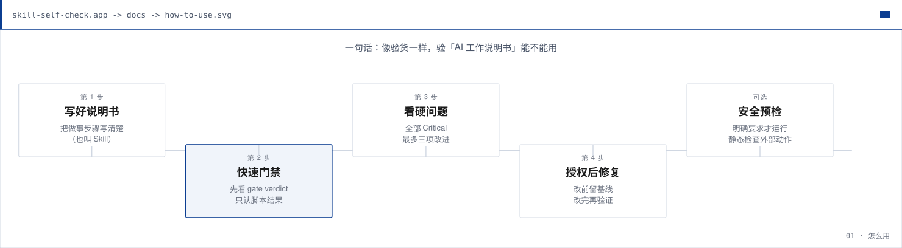

### 2. 改完再检（闭环）

写好 → 跑检查 → 看报告；**不过就改，改完再跑**。结构、契约和静态安全共同达到企业主线门槛后，可以进入受控试用；涉及外部发送或真实数据时仍需单独的行为安全验证。

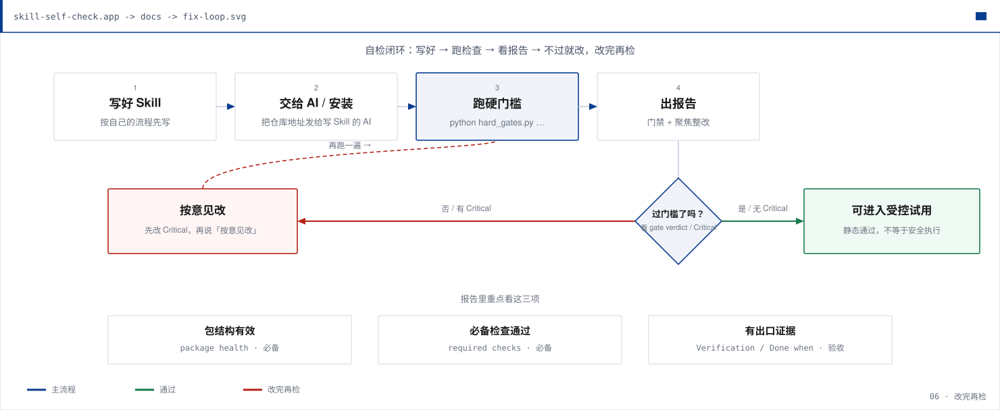

### 3. 三盏灯怎么读（给老板）

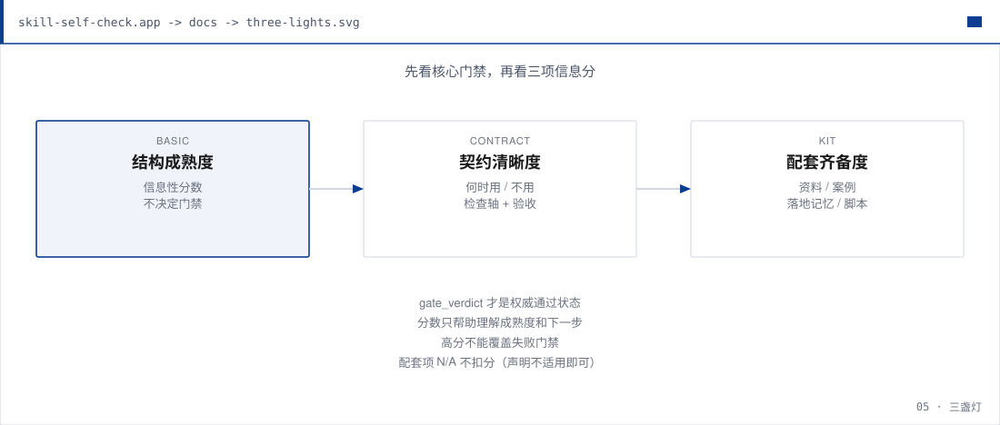

| 灯 | 白话 |
| --- | --- |
| 绿灯 `basic_usable` | 结构过关，达到静态基础门槛 |
| 黄灯 `contract_clarity` | 查什么、何时用 / 不用、验收说清楚了吗 |
| 蓝灯 `support_kit` | 资料 / 案例 / 落地记忆 / 脚本是否按需配齐 |
| 三盏都亮 | 可以进入受控试用；不等于真实行为已验证 |
| 绿灯亮、黄或蓝暗 | 静态可用，但容易各做各的或不好交接 |
| 绿灯不亮 | 先改，别急着推广 |
| 蓝灯某项 N/A | 声明不适用即可，不扣分 |

### 4. PDCA：做事要闭环

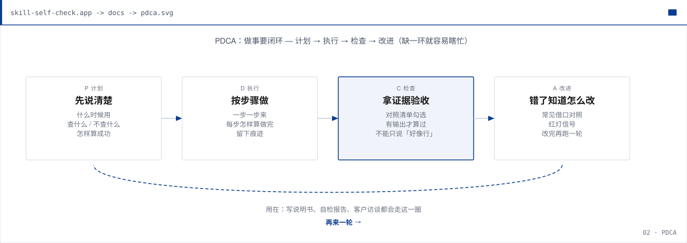

计划 → 执行 → 检查 → 改进。缺「检查」或「改进」，就容易变成瞎忙。

### 5. SMART：目标要说人话

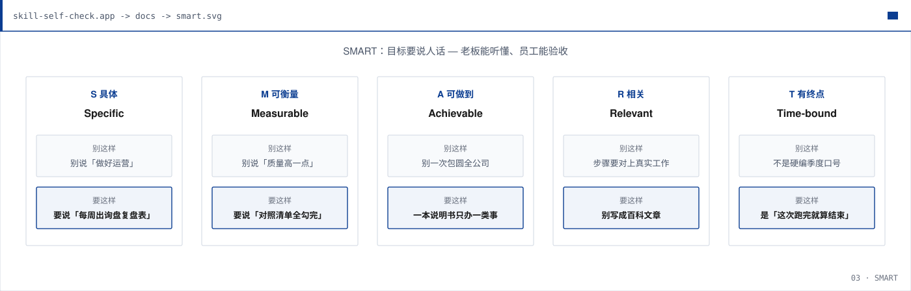

别说「做好运营」；要说清交付物、怎么验收、这次跑完算结束。

### 6. 5W2H：跟客户谈话问清楚

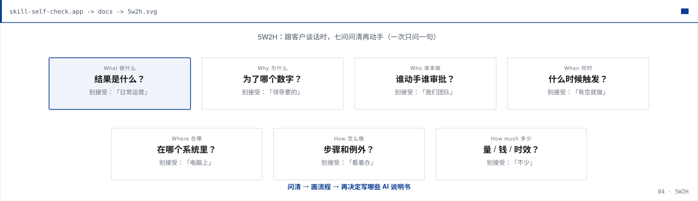

做什么 / 为什么 / 谁 / 何时 / 在哪 / 怎么做 / 多少——**一次只问一句**，口号式回答要追问。  
访谈稿：[exp/pm-workflow-planning/INTERVIEW.md](exp/pm-workflow-planning/INTERVIEW.md)

流程梳理实验区会先判断是否需要业务数据模块；不明确时问用户一次并给出建议。
需要重复分级、取证或复盘时，可按情况启用 `L1–L3` 业务价值、`S1–S3`
来源等级、`V0–V3` 验证强度和运行记录。合理的 `N/A` 不影响通用自检。详见
[operational-data-contract.md](exp/pm-workflow-planning/references/operational-data-contract.md)。

## 三分钟上手

```powershell
git clone https://github.com/xenos2025/Skill-Self-Check.git
cd Skill-Self-Check
./install.ps1
py -3 skills/skill-self-check/scripts/run_full_audit.py C:\你的Skill目录 `
  --out-dir "$HOME\Documents\skill-audits\本次成绩单" --pretty
```

上面一条审计命令会生成**个人能力成绩单**和**项目检测成绩单**两份离线 HTML，
并证明审计前后目标没有变化；真实报告会被拒绝写入目标或源码仓库。也可以在
Cursor 里点名 **skill-self-check**，给出待检说明书路径。默认只出报告；说
「按意见改」再改文件。同一次检查还会生成两种文字报告：普通用户版讲
“能不能用、为什么、下一步”，技术版保留分数、问题编号和证据。

改完对照（把 `baseline.json` 换成一键审计输出里的 `hard-gates.json`）：

```powershell
py -3 skills/skill-self-check/scripts/verify_fix.py C:\你的Skill目录 `
  --baseline "$HOME\Documents\skill-audits\本次成绩单\hard-gates.json" --pretty
```

## 成绩单长什么样（示例截图）

跑完一键审计后，用浏览器打开输出目录里的 HTML 即可。个人页默认看**成长画像**
（类型、等级、下一练习）；项目页默认看**检测结果**（分数、风险、整改优先级）。
默认面向企业做出**可用的业务 Skill 员工**；行为证据 / 跨平台属于可选的
**高级审计（作者轨道）**，不是日常合格线。
下面是对本仓库四件套的脱敏示例（不含真实客户数据）：

### 个人能力成绩单 · 成长画像

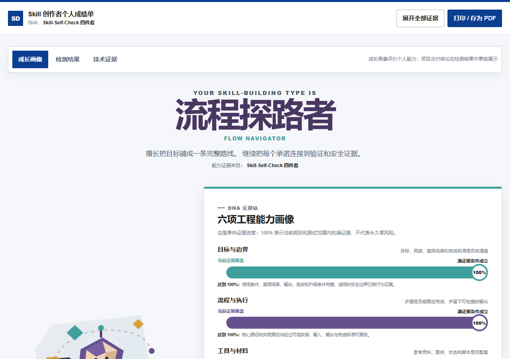

看什么：你的 Skill 创作类型、六项证据轴、优势，以及下一步练习题。

### 项目检测成绩单 · 检测结果

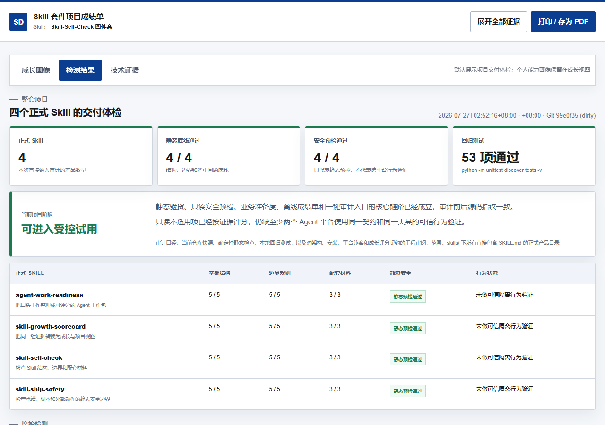

看什么：能不能进入受控试用、四个正式 Skill 的分数矩阵、静态安全与回归测试结论。

两份成绩单共用同一组 JSON 事实；打印 / 存 PDF 按钮在页面右上角。生成方式见上面
「三分钟上手」，或对整仓运行：

```powershell
py -3 skills/skill-growth-scorecard/scripts/suite_scorecards.py . `
  --out-dir "$HOME\Documents\skill-audits\suite-demo" --pretty
```

## 仓库里有什么（白话）

| 文件夹 | 白话 |
| --- | --- |
| `skills/` | 正式产品（安装器会拷贝） |
| `exp/` | 试验区：客户访谈 → 流程 → 再写说明书（默认不安装） |
| `assets/diagrams/` | 上图；`zh/` 为中文 |
| `assets/scorecards/` | 成绩单示例截图（个人成长 / 项目检测） |
| `tests/` | 回归测试（中文技能、非 UTF-8 文件都覆盖） |
| `docs/` | 安装与设计说明 |

更多：[docs/INSTALLATION.md](docs/INSTALLATION.md) · [docs/PLATFORM-COMPATIBILITY.md](docs/PLATFORM-COMPATIBILITY.md) · [docs/AUDIENCE.md](docs/AUDIENCE.md) · [exp/README.md](exp/README.md)

正式产品共四块：业务准备度、Skill 结构自检、安全预检、成长成绩单。它们都只
读取本地文件；真实客户报告默认不应提交到这个开源仓库。自检还含效率护栏
（无限重试 / 超长说明书）和改完复核（`verify_fix.py`），避免“改了就算修好”。

### 平台适配进度（不是认证）

| 平台 | 状态 | 说明 |
| --- | --- | --- |
| Cursor | 在用 | 日常编写与一键审计入口 |
| Codex | 可测 | 下一组跨平台对照的第二平台 |
| Claude Code | 未测 | 后续适配候选 |
| WorkBuddy | 未测 | 中国市场候选，安装/调用方式待探 |
| Coze | 未测 | 中国市场候选，安装/调用方式待探 |

跨平台“已验证”需要 Cursor + Codex（或任意两个不同平台）使用**同一契约文件**和
**同一脱敏夹具**，并各自留下 `verified` 记录。详见
[docs/PLATFORM-COMPATIBILITY.md](docs/PLATFORM-COMPATIBILITY.md)。

## 致谢与参考（写清楚我们站在谁的肩膀上）

本仓库是**融合与工程化**，不是从零发明整套方法论。详细法律致谢见 [NOTICE](NOTICE)。

| 参考项目 | 链接 | 我们用了什么 | 我们自己的部分 |
| --- | --- | --- | --- |
| Matt Pocock · writing-great-skills | [mattpocock/skills](https://github.com/mattpocock/skills/tree/main/skills/productivity/writing-great-skills) | 可预测性、完成标准、修剪与失败模式等词汇 → 白话检查项 | 自检流程与报告模板 |
| Addy Osmani · agent-skills | [addyosmani/agent-skills](https://github.com/addyosmani/agent-skills) | Skill 解剖、Verification、反合理化、质量门槛 | 脚本打分 + 新手报告 |
| Cursor · create-skill | Cursor 内置 skill 规范 | frontmatter、第三人称 WHAT+WHEN、行数与披露规则 | 与上两者的融合清单 |
| 管理常识 | PDCA · SMART · 5W2H | 作为可检查的 Pass / 访谈法 | 映射到 Skill 字段的具体表 |

## 贡献 / 安全 / 许可

[CONTRIBUTING.md](CONTRIBUTING.md) · [SECURITY.md](SECURITY.md) · [SUPPORT.md](SUPPORT.md) · [MIT](LICENSE) · [NOTICE](NOTICE)

---

# English

A beginner-friendly **Agent Skill self-check pack**: a local Python script scores hard gates; your coding agent suggests fixes — including a **PDCA × SMART** matrix. Nothing is fetched from GitHub at runtime.

Diagrams use a simple Swiss blue/white style. Regenerate with `python branding/generate_diagrams.py`.

## For friends / AI beginners (no terminal required)

1. **Write a Skill your usual way** (any platform). You need a folder that contains `SKILL.md`.
2. **Paste this to the same AI that wrote the Skill:**

```text
Please self-check my Skill with this open-source pack:
https://github.com/xenos2025/Skill-Self-Check

Steps:
1. Clone or open that repo; install skill-self-check (or read skills/skill-self-check/SKILL.md)
2. Run the self-check on my Skill directory (must contain SKILL.md)
3. Report only — do not edit my files until I say “apply fixes”
```

3. **Read the business report's three lights:** if green is off, fix the must-resolve items first. Then check amber (contract) and blue (refs / examples / memory / scripts). A static green light is not behavioral or execution proof.
4. **After “apply fixes”, prove the delta:** re-check against the pre-edit `hard-gates.json` with `verify_fix.py`. Do not claim “fixed” from memory.

**Two tracks:** the enterprise mainline (structure / contract / static safety) is the daily bar for controlled trial. Behavior evidence and cross-platform fingerprints are optional **advanced audit** for authors — missing them is not a mainline failure.

## Visual guide

### How it works

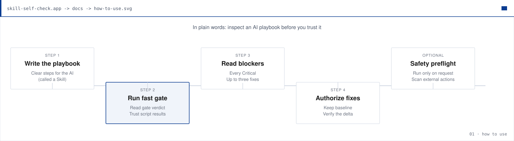

### Fix & retry loop

Write → run gates → report; if it fails, fix and run again. Passing the enterprise mainline (package/ship floor, contract minimum, and static safety) means the skill is ready for a controlled trial, not that external actions are proven safe.

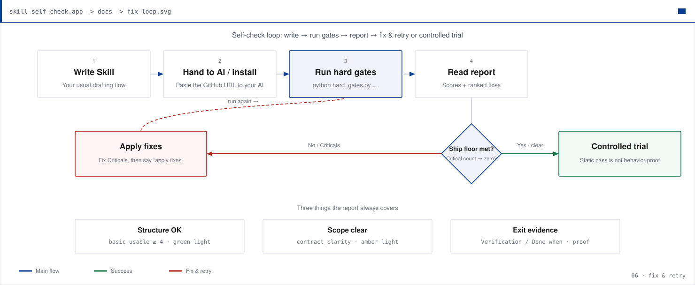

### Three lights (boss-friendly scores)

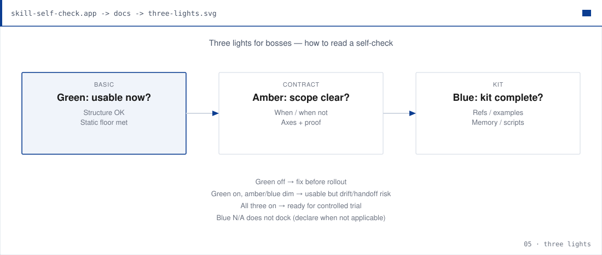

### PDCA

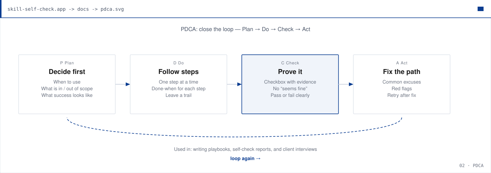

### SMART

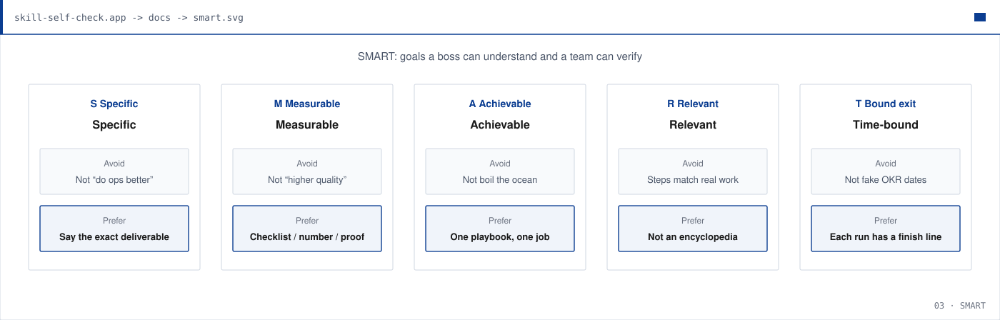

### 5W2H interviews

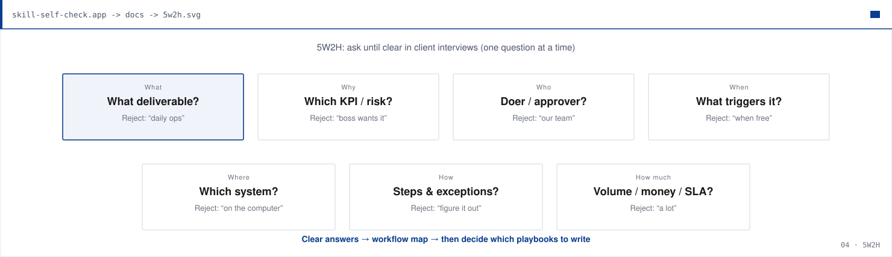

The workflow-planning experiment first judges whether business-data modules are
useful and asks once with a recommendation when unclear. It can selectively
enable `L1–L3` value, `S1–S3` source fitness, `V0–V3` verification, and run
records. A justified N/A does not lower the general self-check score. See
[operational-data-contract.md](exp/pm-workflow-planning/references/operational-data-contract.md).

## Quick start

```bash
git clone https://github.com/xenos2025/Skill-Self-Check.git
cd Skill-Self-Check
./install.sh   # or ./install.ps1 on Windows
python skills/skill-self-check/scripts/run_full_audit.py \
  /path/to/your-skill \
  --out-dir "$HOME/Documents/skill-audits/current" --pretty
```

The command creates separate **personal** and **project** offline HTML
scorecards and records that the audit did not change the target. Real outputs
are refused inside the target or its source repository. In Cursor, invoke
**skill-self-check** and pass a skill path. Report-only by default; say “apply
fixes” to edit. To prove fixes:

```bash
python skills/skill-self-check/scripts/verify_fix.py /path/to/your-skill \
  --baseline "$HOME/Documents/skill-audits/current/hard-gates.json" --pretty
```

## What the scorecards look like

After the one-command audit, open the HTML files in a browser. The personal
card defaults to **Growth Profile**; the project card defaults to **Detection
Results**. Screenshots below are a sanitized run of this repository’s four
shipped Skills (no client data):

### Personal capability · Growth Profile


Shows Skill-building type, six evidence axes, strengths, and the next practice quest.

### Project delivery · Detection Results


Shows controlled-trial readiness, the four-Skill score matrix, static safety, and regression tests.

Both views share one JSON fact set. Use Print / Save as PDF from the page header.
Whole-suite generation:

```bash
python skills/skill-growth-scorecard/scripts/suite_scorecards.py . \
  --out-dir "$HOME/Documents/skill-audits/suite-demo" --pretty
```

## Layout

```text
skills/skill-self-check/    # static structure/contract audit
skills/skill-ship-safety/   # static external-action preflight
skills/agent-work-readiness/# oral workflow → B0–B6 readiness
skills/skill-growth-scorecard/ # JSON facts → offline growth scorecard
exp/                        # PM interview → workflow experiments (not installed)
tests/                      # regression suite mirrored by CI
assets/diagrams/            # EN SVGs · zh/ for Chinese
assets/scorecards/          # README scorecard screenshots
branding/generate_diagrams.py
docs/
```

Chinese and English skills score identically: `用于` / `适用` / `当用户` count as WHEN triggers, and `何时不用` / `检查轴` / `验收` are recognised headings. A non-UTF-8 `SKILL.md` is scored and flagged (`1.11`) rather than crashing the run.

### Platform matrix (not a certification)

| Platform | Status | Notes |
| --- | --- | --- |
| Cursor | In active use | Primary authoring + full-audit entry |
| Codex | Available for testing | Chosen second platform for the next comparable pair |
| Claude Code | Not tested yet | Later adapter candidate |
| WorkBuddy | Not tested yet | China-market candidate |
| Coze | Not tested yet | China-market candidate |

Cross-platform credit needs two distinct platforms sharing the same contract and
sanitized fixture identifiers. See
[PLATFORM COMPATIBILITY](docs/PLATFORM-COMPATIBILITY.md).

## Docs

[INSTALLATION](docs/INSTALLATION.md) · [PLATFORM COMPATIBILITY](docs/PLATFORM-COMPATIBILITY.md) · [ARCHITECTURE](docs/ARCHITECTURE.md) · [AUDIENCE](docs/AUDIENCE.md) · [DESIGN](docs/DESIGN.md) · [FEATURES](docs/FEATURES.md) · [TROUBLESHOOTING](docs/TROUBLESHOOTING.md) · [TODO](TODO.md)

## Credits / references

This pack **fuses and engineers** prior work; it does not claim to invent the whole methodology. Legal acknowledgements: [NOTICE](NOTICE).

| Project | What we reused | What is ours |
| --- | --- | --- |
| [mattpocock/skills — writing-great-skills](https://github.com/mattpocock/skills/tree/main/skills/productivity/writing-great-skills) | Predictability, completion criteria, pruning / failure modes → plain checklist | Self-check flow + report |
| [addyosmani/agent-skills](https://github.com/addyosmani/agent-skills) | Skill anatomy, Verification, rationalizations, quality bar | Scripted scores + beginner report |
| Cursor `create-skill` | Frontmatter, third-person WHAT+WHEN, length / disclosure | Fused checklist |
| PDCA · SMART · 5W2H | Classic management heuristics as checkable passes / interview method | Mapping onto Skill fields |

## Contributing / security / license

[CONTRIBUTING.md](CONTRIBUTING.md) · [CODE_OF_CONDUCT.md](CODE_OF_CONDUCT.md) · [SECURITY.md](SECURITY.md) · [SUPPORT.md](SUPPORT.md) · [PRIVACY.md](PRIVACY.md) · [MIT](LICENSE) · [NOTICE](NOTICE)
